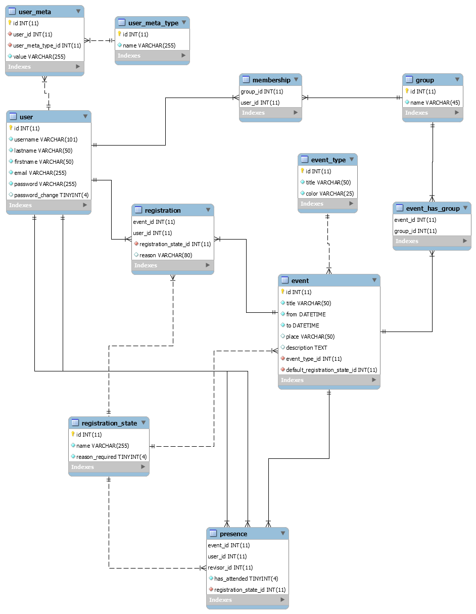

# Database documentation

## Registration
In the table "registration" the information is stored, which feedback the users have given to an event before it has started.
## Presence
The table "presence" stores the information whether a user was present at an event or not.
